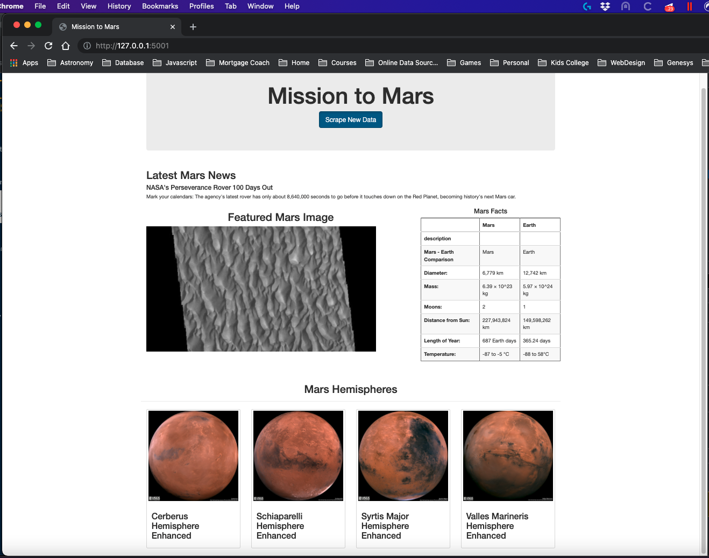
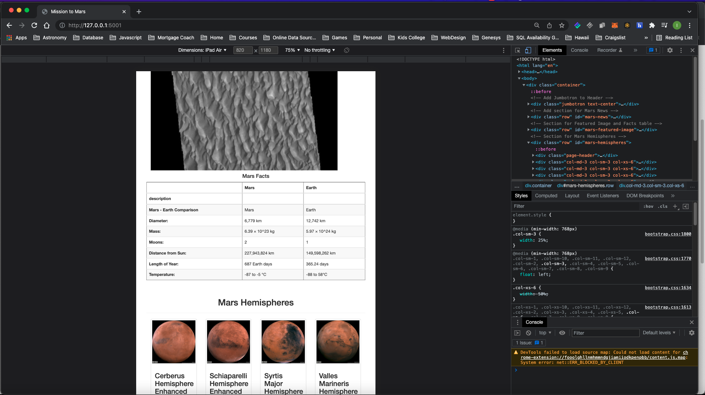
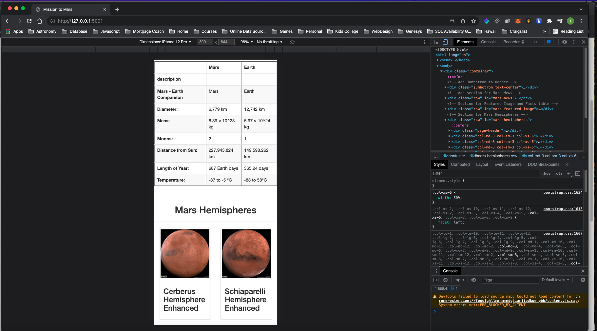

# Mission-to-Mars
## Overview
For our 10th data analysis project we were tasked with doing using new webscraping tools Splinter and BeautifulSoup as well as Webdriver to automatically browse a websites containing data about mars, collect that data, and then store it in a mongodb database.  In addition, we used Flask to build a website to re-display all the information, including images, that we collected.  We made the site dynamic by putting a button to scrape for new data on demand. 
## Results
Here are some images of the site that was built, including versions for ipad and iphone

 

 

 

## Summary 
To clean up the site a bit, I formatted the table using bootstrap, but adding table table-striped to the class for the table.  Since the html for the table was automatically added, I used python's string replace to replace the class information since the table came in with the class "dataframe".  I also reducted the Mars Hemispheres to only use 3 columns and adding the thumb class to make them resemble thumbnails and all fit horizontally on a desktop page.  For the other grid based columns, I added different column styling for mobile and desktop and checked it via the Chrome devtools. 